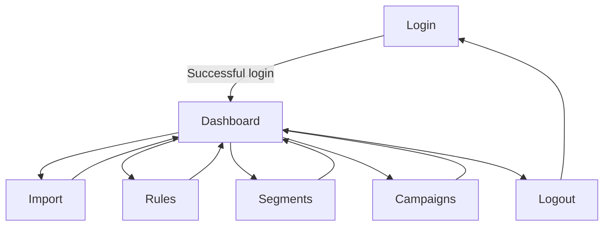

## 1. Product Overview
A single-file PHP 8+ + SQLite web app for managing contact imports, rules, segments, and campaigns.
It uses session authentication and CSRF protection on all POST actions, with a minimal black/white Inter UI.

## 2. Core Features

### 2.1 User Roles
| Role | Registration Method | Core Permissions |
|------|---------------------|------------------|
| Admin User | Pre-seeded in SQLite (first-run bootstrap) | Full access to dashboard modules; can import data; manage rules/segments/campaigns; run campaign actions |

### 2.2 Feature Module
Our requirements consist of the following main pages:
1. **Login**: credential entry, session start, error states.
2. **Dashboard**: navigation, Import, Rules, Segments, Campaigns modules in one workspace.

### 2.3 Page Details
| Page Name | Module Name | Feature description |
|-----------|-------------|---------------------|
| Login | Login form | Authenticate with username/email + password; create session on success; show validation errors. |
| Login | CSRF | Generate CSRF token on page load; require token for login POST. |
| Dashboard | App shell | Show header with app name + current user + logout; show left nav (tabs) for Import/Rules/Segments/Campaigns. |
| Dashboard | Import | Upload CSV; validate headers; preview row counts; persist import job; show import history with status/errors. |
| Dashboard | Rules | Create/edit/disable rules; define rule conditions and outcomes used by segmentation/campaigns; list/search rules. |
| Dashboard | Segments | Create/edit/delete segments; build segment criteria referencing rules; show segment size estimate (based on stored data). |
| Dashboard | Campaigns | Create/edit campaigns; attach one or more segments; set campaign status (draft/active/paused); show recent runs/events summary. |
| Dashboard | CSRF | Attach CSRF token to all POST forms; reject invalid token with safe error message. |
| Dashboard | Session & access control | Require authenticated session for dashboard; redirect unauthenticated users to Login; support logout that clears session. |

## 3. Core Process
**Admin Flow**
1. You open the app and sign in on the Login page.
2. You land on the Dashboard and choose a module via the left navigation.
3. You upload a CSV in Import and confirm the preview; the app stores the import and shows its status.
4. You create Rules that express matching/labeling logic used by segmentation.
5. You create Segments by combining rules/criteria and confirm the estimated size.
6. You create Campaigns, attach segments, and switch campaign status between draft/active/paused.
7. You log out from the header.

