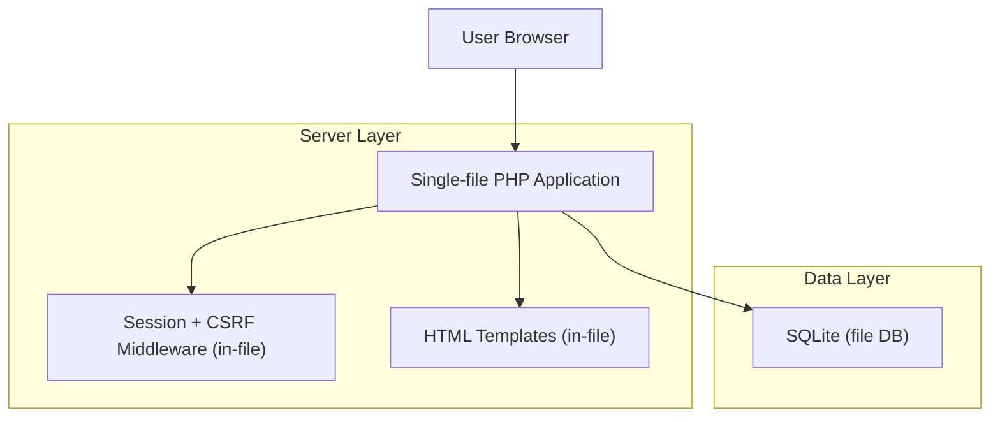
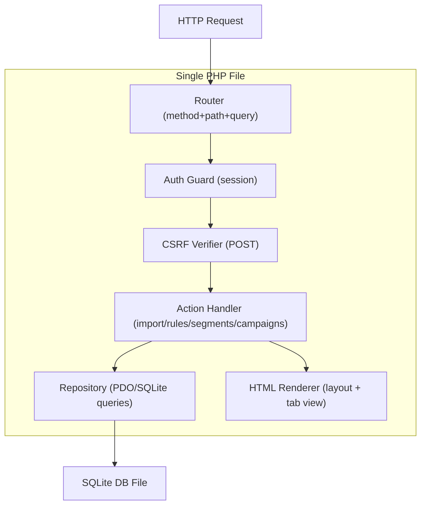
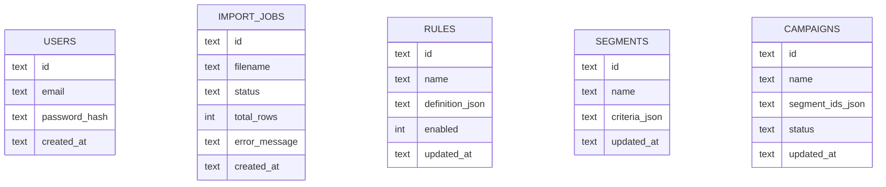

## 1.Architecture design


## 2.Technology Description
- Frontend: Server-rendered HTML + minimal CSS (Inter font, black/white theme)
- Backend: PHP@8+ (single entry file) with built-in sessions
- Database: SQLite@3 (PDO)

## 3.Route definitions
| Route | Purpose |
|-------|---------|
| GET /login | Render login form and issue CSRF token |
| POST /login | Validate CSRF; verify credentials; start session |
| POST /logout | Validate CSRF; destroy session |
| GET / | Auth-gated dashboard (default tab) |
| GET /?tab=import | Import module (history + upload form) |
| POST /import | Validate CSRF; accept CSV upload; create import job + store metadata |
| GET /?tab=rules | Rules module |
| POST /rules/save | Validate CSRF; create/update rule |
| POST /rules/toggle | Validate CSRF; enable/disable rule |
| GET /?tab=segments | Segments module |
| POST /segments/save | Validate CSRF; create/update segment |
| POST /segments/delete | Validate CSRF; delete segment |
| GET /?tab=campaigns | Campaigns module |
| POST /campaigns/save | Validate CSRF; create/update campaign |
| POST /campaigns/status | Validate CSRF; set campaign status |

## 4.API definitions (If it includes backend services)
### 4.1 Shared Types (conceptual)
```ts
type Id = string; // UUID-ish string

type ImportJob = {
  id: Id;
  filename: string;
  status: 'pending' | 'processed' | 'failed';
  total_rows: number;
  error_message?: string;
  created_at: string;
};

type Rule = {
  id: Id;
  name: string;
  definition_json: string; // JSON string representing conditions/outcomes
  enabled: boolean;
  updated_at: string;
};

type Segment = {
  id: Id;
  name: string;
  criteria_json: string; // JSON string (references rules/conditions)
  updated_at: string;
};

type Campaign = {
  id: Id;
  name: string;
  segment_ids_json: string; // JSON array of segment ids
  status: 'draft' | 'active' | 'paused';
  updated_at: string;
};
```

## 5.Server architecture diagram (If it includes backend services)


## 6.Data model(if applicable)

### 6.1 Data model definition


### 6.2 Data Definition Language
Users (users)
```
CREATE TABLE IF NOT EXISTS users (
  id TEXT PRIMARY KEY,
  email TEXT UNIQUE NOT NULL,
  password_hash TEXT NOT NULL,
  created_at TEXT NOT NULL
);
```

Import jobs (import_jobs)
```
CREATE TABLE IF NOT EXISTS import_jobs (
  id TEXT PRIMARY KEY,
  filename TEXT NOT NULL,
  status TEXT NOT NULL,
  total_rows INTEGER NOT NULL DEFAULT 0,
  error_message TEXT,
  created_at TEXT NOT NULL
);
```

Rules (rules)
```
CREATE TABLE IF NOT EXISTS rules (
  id TEXT PRIMARY KEY,
  name TEXT NOT NULL,
  definition_json TEXT NOT NULL,
  enabled INTEGER NOT NULL DEFAULT 1,
  updated_at TEXT NOT NULL
);
```

Segments (segments)
```
CREATE TABLE IF NOT EXISTS segments (
  id TEXT PRIMARY KEY,
  name TEXT NOT NULL,
  criteria_json TEXT NOT NULL,
  updated_at TEXT NOT NULL
);
```

Campaigns (campaigns)
```
CREATE TABLE IF NOT EXISTS campaigns (
  id TEXT PRIMARY KEY,
  name TEXT NOT NULL,
  segment_ids_json TEXT NOT NULL,
  status TEXT NOT NULL,
  updated_at TEXT NOT NULL
);
```

Bootstrap (first run)
```
-- Create a single admin user manually (example placeholder)
-- Password must be stored as password_hash(...) output
INSERT OR IGNORE INTO users (id, email, password_hash, created_at)
VALUES ('admin-1', 'admin@example.com', '$2y$...bcrypt...', datetime('now'));
```
